# Cab Booking Application 🚕

A modern, full-stack Cab Booking application designed to simplify urban commuting by bridging the gap between riders and drivers. Built with an **Angular** single-page frontend architecture and a robust **Express/Node.js** REST API backend, the platform leverages secure JWT authentication, real-time map integration, and an intuitive state-driven interface.

---

## 🏗️ Architecture & Module Flow

The following interactive system architecture blueprint details how the frontend presentation layers communicate with domain services, and how those services talk to the backend ecosystem:

```mermaid
flowchart TD

subgraph group_client["Angular client"]
  node_client_main["Bootstrap<br/>Angular entry<br/>[main.ts]"]
  node_client_shell["App shell<br/>Angular shell<br/>[app.ts]"]
  node_client_routes["Routes<br/>Angular router<br/>[app.routes.ts]"]
  node_client_config["Config<br/>Angular providers<br/>[app.config.ts]"]
  node_client_nav["Navbar<br/>shared UI<br/>[navbar.ts]"]
  node_client_popup["Popups<br/>shared UI<br/>[popup-message.ts]"]
  node_client_auth["Auth core<br/>security services<br/>[auth-service.ts]"]
  node_client_geo["Maps & route<br/>location services"]
  node_client_booking_services["Booking services<br/>domain services<br/>[ride-service.ts]"]
  node_client_home["Home<br/>screen<br/>[home.ts]"]
  node_client_login["Login<br/>screen<br/>[login.ts]"]
  node_client_signup["Sign up<br/>screen<br/>[user-signup.ts]"]
  node_client_booking_flow["Ride flow<br/>screen flow<br/>[ride-request.ts]"]
  node_client_trip_views["Trips & profile<br/>screen group<br/>[my-trips.ts]"]
  node_client_driver_dash["Driver dashboard<br/>screen"]
  node_client_map["Map<br/>screen<br/>[map.ts]"]
  node_client_about["About<br/>screen<br/>[about.ts]"]
  node_client_notfound["Not found<br/>fallback screen<br/>[not-found.ts]"]
end

subgraph group_server["Express server"]
  node_server_app["API app<br/>Express entry<br/>[app.js]"]
  node_server_db["DB connect<br/>database config<br/>[connectDB.js]"]
  node_server_authmw["Auth middleware<br/>Express middleware<br/>[authMiddleware.js]"]
  node_server_routes["Routes<br/>[authRoutes.js]"]
  node_server_ctrl["Controllers<br/>[authController.js]"]
  node_server_models[("Models<br/>[user.js]")]
end

node_client_main -->|"bootstraps"| node_client_shell
node_client_shell -->|"navigates"| node_client_routes
node_client_shell -->|"renders"| node_client_nav
node_client_shell -->|"renders"| node_client_popup
node_client_config -->|"provides"| node_client_auth
node_client_routes -->|"maps"| node_client_home
node_client_routes -->|"maps"| node_client_login
node_client_routes -->|"maps"| node_client_signup
node_client_routes -->|"maps"| node_client_booking_flow
node_client_routes -->|"maps"| node_client_trip_views
node_client_routes -->|"maps"| node_client_driver_dash
node_client_routes -->|"maps"| node_client_map
node_client_routes -->|"maps"| node_client_about
node_client_routes -->|"fallback"| node_client_notfound
node_client_booking_flow -->|"uses"| node_client_booking_services
node_client_booking_flow -->|"uses"| node_client_geo
node_client_map -->|"uses"| node_client_geo
node_client_auth -->|"protects"| node_client_login
node_client_auth -->|"protects"| node_client_trip_views
node_client_auth -->|"protects"| node_client_driver_dash
node_client_booking_services -->|"calls APIs"| node_server_routes
node_client_auth -->|"sends auth"| node_server_routes
node_server_app -->|"connects"| node_server_db
node_server_app -->|"uses"| node_server_authmw
node_server_app -->|"mounts"| node_server_routes
node_server_routes -->|"dispatches"| node_server_ctrl
node_server_ctrl -->|"persists"| node_server_models
node_server_authmw -->|"guards"| node_server_routes

click node_client_main "[https://github.com/anuragsingh0123/cab_booking/blob/main/client/src/main.ts](https://github.com/anuragsingh0123/cab_booking/blob/main/client/src/main.ts)"
click node_client_shell "[https://github.com/anuragsingh0123/cab_booking/blob/main/client/src/app/app.ts](https://github.com/anuragsingh0123/cab_booking/blob/main/client/src/app/app.ts)"
click node_client_routes "[https://github.com/anuragsingh0123/cab_booking/blob/main/client/src/app/app.routes.ts](https://github.com/anuragsingh0123/cab_booking/blob/main/client/src/app/app.routes.ts)"
click node_client_config "[https://github.com/anuragsingh0123/cab_booking/blob/main/client/src/app/app.config.ts](https://github.com/anuragsingh0123/cab_booking/blob/main/client/src/app/app.config.ts)"
click node_client_nav "[https://github.com/anuragsingh0123/cab_booking/blob/main/client/src/app/navbar/navbar.ts](https://github.com/anuragsingh0123/cab_booking/blob/main/client/src/app/navbar/navbar.ts)"
click node_client_popup "[https://github.com/anuragsingh0123/cab_booking/blob/main/client/src/app/popup-message/popup-message.ts](https://github.com/anuragsingh0123/cab_booking/blob/main/client/src/app/popup-message/popup-message.ts)"
click node_client_auth "[https://github.com/anuragsingh0123/cab_booking/blob/main/client/src/app/auth-service.ts](https://github.com/anuragsingh0123/cab_booking/blob/main/client/src/app/auth-service.ts)"
click node_client_geo "[https://github.com/anuragsingh0123/cab_booking/blob/main/client/src/app/location-service.ts](https://github.com/anuragsingh0123/cab_booking/blob/main/client/src/app/location-service.ts)"
click node_client_booking_services "[https://github.com/anuragsingh0123/cab_booking/blob/main/client/src/app/ride-service.ts](https://github.com/anuragsingh0123/cab_booking/blob/main/client/src/app/ride-service.ts)"
click node_client_home "[https://github.com/anuragsingh0123/cab_booking/blob/main/client/src/app/home/home.ts](https://github.com/anuragsingh0123/cab_booking/blob/main/client/src/app/home/home.ts)"
click node_client_login "[https://github.com/anuragsingh0123/cab_booking/blob/main/client/src/app/login/login.ts](https://github.com/anuragsingh0123/cab_booking/blob/main/client/src/app/login/login.ts)"
click node_client_signup "[https://github.com/anuragsingh0123/cab_booking/blob/main/client/src/app/user-signup/user-signup.ts](https://github.com/anuragsingh0123/cab_booking/blob/main/client/src/app/user-signup/user-signup.ts)"
click node_client_booking_flow "[https://github.com/anuragsingh0123/cab_booking/blob/main/client/src/app/ride-request/ride-request.ts](https://github.com/anuragsingh0123/cab_booking/blob/main/client/src/app/ride-request/ride-request.ts)"
click node_client_trip_views "[https://github.com/anuragsingh0123/cab_booking/blob/main/client/src/app/my-trips/my-trips.ts](https://github.com/anuragsingh0123/cab_booking/blob/main/client/src/app/my-trips/my-trips.ts)"
click node_client_driver_dash "[https://github.com/anuragsingh0123/cab_booking/blob/main/client/src/app/driver-dashboard/driver-dashboard.ts](https://github.com/anuragsingh0123/cab_booking/blob/main/client/src/app/driver-dashboard/driver-dashboard.ts)"
click node_client_map "[https://github.com/anuragsingh0123/cab_booking/blob/main/client/src/app/map/map.ts](https://github.com/anuragsingh0123/cab_booking/blob/main/client/src/app/map/map.ts)"
click node_client_about "[https://github.com/anuragsingh0123/cab_booking/blob/main/client/src/app/about/about.ts](https://github.com/anuragsingh0123/cab_booking/blob/main/client/src/app/about/about.ts)"
click node_client_notfound "[https://github.com/anuragsingh0123/cab_booking/blob/main/client/src/app/not-found/not-found.ts](https://github.com/anuragsingh0123/cab_booking/blob/main/client/src/app/not-found/not-found.ts)"
click node_server_app "[https://github.com/anuragsingh0123/cab_booking/blob/main/server/app.js](https://github.com/anuragsingh0123/cab_booking/blob/main/server/app.js)"
click node_server_db "[https://github.com/anuragsingh0123/cab_booking/blob/main/server/config/connectDB.js](https://github.com/anuragsingh0123/cab_booking/blob/main/server/config/connectDB.js)"
click node_server_authmw "[https://github.com/anuragsingh0123/cab_booking/blob/main/server/middleware/authMiddleware.js](https://github.com/anuragsingh0123/cab_booking/blob/main/server/middleware/authMiddleware.js)"
click node_server_routes "[https://github.com/anuragsingh0123/cab_booking/blob/main/server/routes/authRoutes.js](https://github.com/anuragsingh0123/cab_booking/blob/main/server/routes/authRoutes.js)"
click node_server_ctrl "[https://github.com/anuragsingh0123/cab_booking/blob/main/server/controllers/authController.js](https://github.com/anuragsingh0123/cab_booking/blob/main/server/controllers/authController.js)"
click node_server_models "[https://github.com/anuragsingh0123/cab_booking/blob/main/server/models/user.js](https://github.com/anuragsingh0123/cab_booking/blob/main/server/models/user.js)"

classDef toneNeutral fill:#f8fafc,stroke:#334155,stroke-width:1.5px,color:#0f172a
classDef toneBlue fill:#dbeafe,stroke:#2563eb,stroke-width:1.5px,color:#172554
classDef toneAmber fill:#fef3c7,stroke:#d97706,stroke-width:1.5px,color:#78350f
classDef toneMint fill:#dcfce7,stroke:#16a34a,stroke-width:1.5px,color:#14532d
classDef toneRose fill:#ffe4e6,stroke:#e11d48,stroke-width:1.5px,color:#881337
classDef toneIndigo fill:#e0e7ff,stroke:#4f46e5,stroke-width:1.5px,color:#312e81
classDef toneTeal fill:#ccfbf1,stroke:#0f766e,stroke-width:1.5px,color:#134e4a
class node_client_main,node_client_shell,node_client_routes,node_client_config,node_client_nav,node_client_popup,node_client_auth,node_client_geo,node_client_booking_services,node_client_home,node_client_login,node_client_signup,node_client_booking_flow,node_client_trip_views,node_client_driver_dash,node_client_map,node_client_about,node_client_notfound toneBlue
class node_server_app,node_server_db,node_server_authmw,node_server_routes,node_server_ctrl,node_server_models toneAmber
```



---

## 🚀 Key Features

### 👤 Rider Experience
* **Dynamic Ride Request Flow:** Intuitive multi-step panel to request rides, select vehicle variants, and estimate fares.
* **Interactive Live Mapping:** Integrated maps and geolocation route tracing utilizing native HTML5 or premium mapping services.
* **Trip Ledger:** Access historical ride history, metrics, receipts, and user account configurations.

### 🚘 Driver Interface
* **Driver Dashboard:** Interactive control station allowing drivers to manage active telemetry, route paths, and ride assignment handshakes.
* **Status Controls:** Toggle operational statuses cleanly to engage/disengage with the queue.

### 🛡️ Core Infrastructure & Security
* **Guarded Routing Systems:** Route guards on both client and server prevent unauthorized layout transitions or deep API access.
* **Session Lifecycle Persistence:** State machines managed through Angular Providers with custom JWT verification interceptors.

---

## 📂 Codebase Directory Breakdown

Based on the core map of the software architecture, the repository is cleanly decoupled:

### 🌐 Client (Angular Frontend)
* `src/main.ts` — Main bootstrap runtime for the Angular framework lifecycle.
* `src/app/app.ts` — Core Shell Layout containing root templates and global components (e.g., Navbar, Global Popup Message brokers).
* `src/app/app.routes.ts` — Explicit centralized system router table mapping paths directly to components with built-in route guard chains.
* `src/app/auth-service.ts` — Security singleton managing user identity headers, login states, and permission profiles.
* `src/app/ride-service.ts` / `location-service.ts` — Domain singletons bridging component requests to mapping data and HTTP API operations.

### ⚙️ Server (Express.js Backend)
* `app.js` — Core application bootstrap mounting security layers, configurations, and endpoint registries.
* `config/connectDB.js` — Persistence broker connecting structural or non-structural database instances to active queries.
* `middleware/authMiddleware.js` — High-speed interceptor parsing headers for Bearer tokens to protect down-stream controller workflows.
* `routes/authRoutes.js` — Explicit exposure layers handling HTTP verb dispatches to specialized transaction logic.
* `controllers/authController.js` — Isolation logic evaluating payloads, orchestrating hashing functions, and interacting with database layer models.
* `models/user.js` — Data Schemas standardizing structures across operational collections.

---

## 🛠️ Installation & Local Setup

### Prerequisites
* **Node.js** (v18.x or above recommended)
* **npm** or **yarn** package manager
* Database instance (e.g., MongoDB / PostgreSQL as configured in `connectDB.js`)

### Step-by-Step Configuration

1. **Clone the repository:**
   ```bash
   git clone [https://github.com/anuragsingh0123/cab_booking.git](https://github.com/anuragsingh0123/cab_booking.git)
   cd cab_booking
   ```

2. **Configure Environment Variables:**
   Create a `.env` configuration file within your server sub-directory:
   ```env
   PORT=5000
   DATABASE_URL=your_database_connection_string
   JWT_SECRET=your_super_secure_jwt_secret_phrase
   MAPS_API_KEY=your_maps_provider_api_key
   ```

3. **Install Dependencies & Start Backend Server:**
   ```bash
   cd server
   npm install
   npm start
   ```

4. **Install Dependencies & Start Client Server:**
   ```bash
   cd ../client
   npm install
   npm start
   ```
   Open your browser to `http://localhost:4200` to interact with the frontend app.

---

## 🤝 Contributing

Contributions make the open-source community a stellar environment for learning, creating, and sharing.
1. Fork the Project.
2. Create your Feature Branch (`git checkout -b feature/AmazingFeature`).
3. Commit your changes (`git commit -m 'Add some AmazingFeature'`).
4. Push to the Branch (`git push origin feature/AmazingFeature`).
5. Open a professional Pull Request.

---

## 📄 License

Distributed under the **MIT License**. See `LICENSE` for more information.
